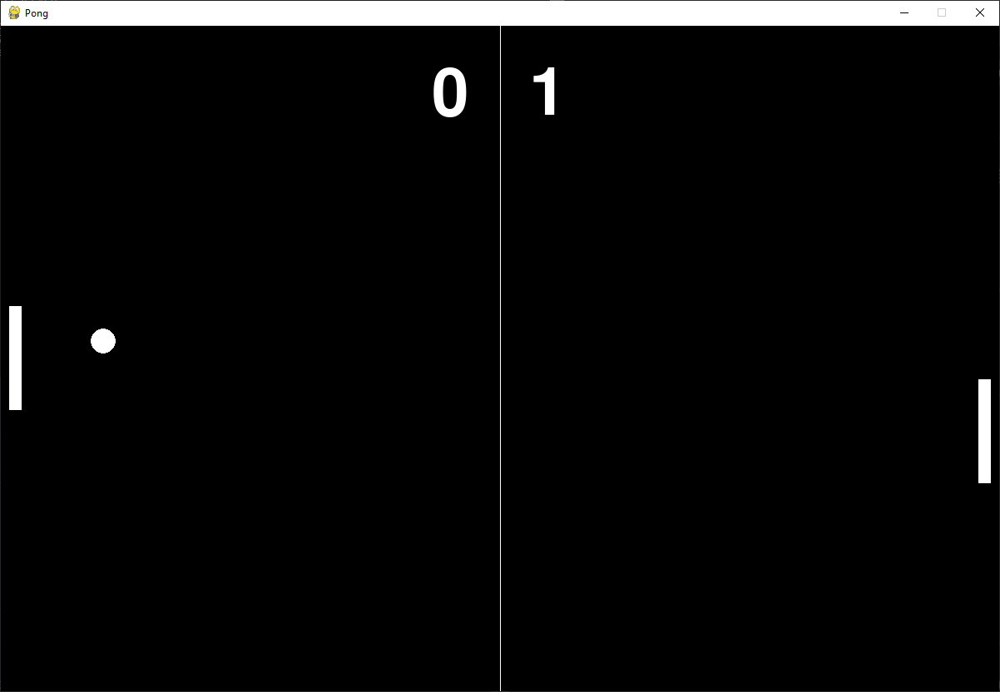

<div id="top"></div>

<!-- PROJECT LOGO -->
<br />
<div align="center">
  <h3 align="center">Classic Pong</h3>

  <p align="center">
    A mini-project to practice Object-oriented programming and learn a little bit of PyGame.
  </p>
</div>

<!-- TABLE OF CONTENTS -->
<details>
  <summary>Table of Contents</summary>
  <ol>
    <li>
      <a href="#getting-started">Getting Started</a>
      <ul>
        <li><a href="#installation">Installation</a></li>
      </ul>
    </li>
  </ol>
</details>

### Built With

* [Pygame](https://www.pygame.org/news)


<!-- GETTING STARTED -->
## Getting Started

The following instructions should get a demo going on your PC.

### Installation

1. Clone the repo

   ```
   git clone https://github.com/fatonhoti/pong.git
   cd pong
   ```
3. Install relevant packages
   ```
   pip install -r requirements.txt
   ```
4. Run the game
   ```
   python pong.py
   ```



